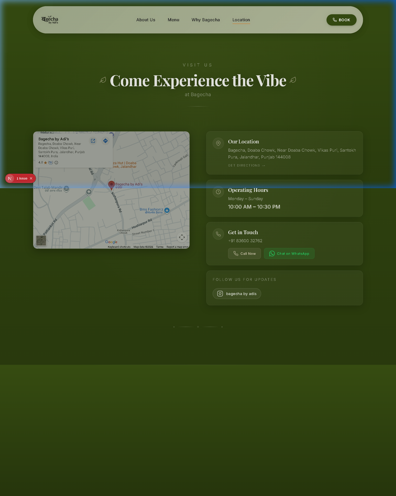

# 🌿 Bagecha by Adi's Cafe
> **Crafted Taste, Premium Experience — Where Nature Meets Comfort.**


## ✨ Overview
Bagecha by Adi's Cafe is a premium, nature-inspired culinary sanctuary. Built with passion and a deep love for creating memorable moments, Bagecha offers an authentic continental experience surrounded by lush greenery and soothing water elements.

This repository contains the official website for Bagecha, featuring a dynamic menu, immersive storytelling, and a premium UI/UX designed to reflect the cafe's organic and sophisticated ambiance.

---

## 🛠️ Tech Stack

<p align="left">
  
  
  
  
  
</p>

- **Frontend:** Next.js 16 (App Router), React 19
- **Styling:** Tailwind CSS 4, Framer Motion for smooth animations
- **Icons:** Lucide React
- **Fonts:** Playfair Display (Serif), Inter (Sans-serif)

---

## 🚀 Key Features

- **🌊 Nature-Inspired UI:** A dark-themed, premium design that mimics the "Garden" (Bagecha) experience.
- **📜 Immersive Storytelling:** A timeline-based journey of the brand's growth since 2019.
- **🍽️ Interactive Menu:** Categorized food menu with high-quality visuals.
- **📍 Multi-Location Support:** Information about flagship outlets in Jalandhar and Rishikesh.
- **📱 Fully Responsive:** Optimized for all devices, from mobile to desktop.
- **⚡ Performance Optimized:** Built with Next.js Turbopack for ultra-fast development and loading.

---

## 📸 Visual Preview

### 🏠 Home & Story
*Experience the journey of Bagecha.*


### 🍱 The Menu
*Explore our authentic continental cuisine.*


### 🗺️ Location & Contact
*Find your way to our garden sanctuary.*


### 🌿 Why Bagecha?
*The philosophy behind our brand.*


---

## 💻 Getting Started

### Prerequisites
- Node.js (Latest LTS)
- npm or yarn

### Installation

1. **Clone the repository:**
   ```bash
   git clone https://github.com/jaygupta-exe/bagecha-cafe.git
   cd bagecha-cafe
   ```

2. **Install dependencies:**
   ```bash
   npm install
   ```

3. **Run the development server:**
   ```bash
   npm run dev
   ```

4. **Build for production:**
   ```bash
   npm run build
   ```

---

## 👤 Author

**Aditya Sharma**  
*Founder & Head Chef*  
Professional Continental Chef with experience at JW Marriott & top franchises.

---

## 📄 License
This project is for demonstration purposes. All rights reserved by Bagecha by Adi's Cafe.

---

<p align="center">
  Built with ❤️ by <a href="https://github.com/jaygupta-exe">Jay Gupta</a>
</p>
